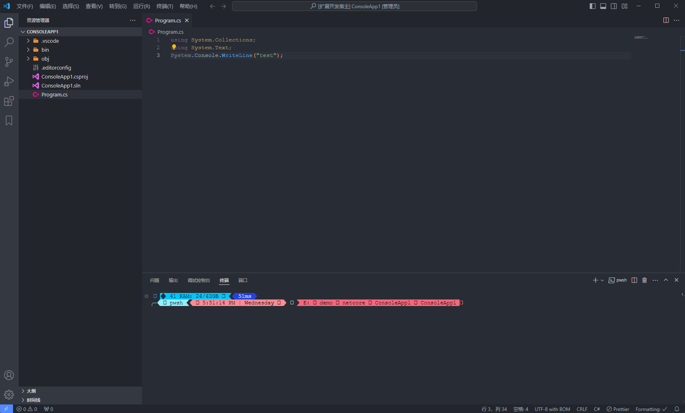

# odinGG-NetCoreTools For Vscode

Install above vscode (version >=1.42.0) and The git plugin needs to be installed.

Fast way to build, run and test .NET Core (C#, F#) project

### Prerequisites

- [.NET Core](https://dotnet.microsoft.com/en-us/download) is installed

### Usage

- Open a .NET Core project, right click on a .csproj, .fsproj or .sln file, and run .NET Core command from context menu.

[]

### Change Log

    See Change Log [here](./CHANGELOG.md)

### v1.0.2

    - 新增创建sln和project
